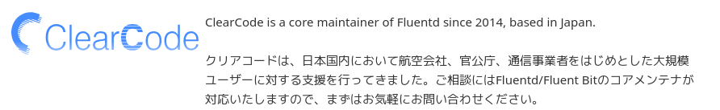

### Hi there 👋

I'm a Free software developer and loves Debian (newbie Debian Developer).

I'm working as a software engineer at [ClearCode Inc](https://www.clear-code.com).
We drive forward free softwares and make the business.

For example, especially developing [Fluentd](https://www.fluentd.org/) as a community member and support it for [enterprise use case](https://www.fluentd.org/enterprise_services) and so on.

<!--
**kenhys/kenhys** is a ✨ _special_ ✨ repository because its `README.md` (this file) appears on your GitHub profile.

Here are some ideas to get you started:

- 🔭 I’m currently working on ...
- 🌱 I’m currently learning ...
- 👯 I’m looking to collaborate on ...
- 🤔 I’m looking for help with ...
- 💬 Ask me about ...
- 📫 How to reach me: ...
- 😄 Pronouns: ...
- ⚡ Fun fact: ...
-->

🔭 As a one free software developer, I’m currently engaging in about making "Unstable Life" comfortable.

The development of free software is important, and I believe that the delivery ecosystem
of free software is also important.

This is why I'm working as a member of Debian Project.

If you have interest to become a GitHub sponsor of mine, see [Become a sponsor to @kenhys](https://github.com/sponsors/kenhys).

<!-- Open Source Summit JAPAN 2023 speaker badge -->
* [Speaker: Open Source Summit Japan 2023](https://www.credly.com/badges/495286dc-e96b-4a4c-b8c0-9036ef3fc735/public_url)

